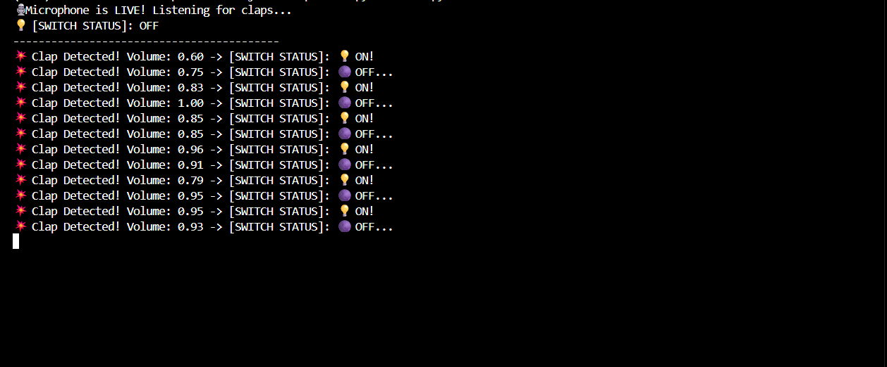

# ClapSwitch


A Python-based clap detection system that listens through the computer microphone and toggles a virtual switch whenever a clap is detected. The application communicates with an Arduino Uno over USB serial to control the built-in LED in real time.

## Features

- Real-time microphone monitoring
- Clap detection using audio peak analysis
- Virtual ON/OFF switch
- Serial communication with Arduino Uno
- Controls the Arduino built-in LED

## Example Output

The screenshot below shows the complete system in operation. When a clap is detected, the Python application updates the switch status and sends a serial command to the Arduino Uno which toggles the built-in LED (Pin 13).



## How It Works

1. The Python application continuously listens to the computer microphone.
2. When a sound exceeds the configured threshold, it is recognized as a clap.
3. The application toggles a virtual switch state.
4. A serial command is sent to the Arduino Uno through the USB connection.
5. The Arduino receives the command and toggles the built-in LED.

## Hardware Required

- Arduino Uno
- USB cable
- Computer with Python installed
- Built-in LED on Arduino (or an external LED)

## Software Requirements

- Python 3.10 or later
- Arduino IDE
- USB Serial Driver (if required for your Arduino board)

## Installation

1. Clone the repository:

```bash
git clone https://github.com/FrankRubandamayonzaMagezi/ClapSwitch.git
```

2. Navigate to the project:

```bash
cd ClapSwitch
```
3. (Optional but recommended) Create and activate a virtual environment.

**Windows**

```bash
python -m venv venv
venv\Scripts\activate
```

**Linux/macOS**

```bash
python3 -m venv venv
source venv/bin/activate
```

4. Install the required Python packages:

```bash
pip install -r requirements.txt
```

## Python Libraries

This project uses the following Python libraries:

- NumPy
- SoundDevice
- PySerial

## Arduino Setup

1. Open `arduino/ClapSwitch_Arduino/ClapSwitch_Arduino.ino` in the Arduino IDE.
2. Select **Board → Arduino Uno**.
3. Select the correct **COM port**.
4. Upload the sketch to the Arduino.
5. Close the Arduino Serial Monitor before running the Python application.

## Running the Project

Run the Python application:

```bash
python main.py
```
When a clap is detected, the Python application sends the character `T` over the USB serial connection. The Arduino receives this command and toggles the built-in LED.

## Project Structure

```
ClapSwitch/
│── arduino/
│   └── ClapSwitch_Arduino/
│       └── ClapSwitch_Arduino.ino
│
│── images/
│   └── clap_system_demo.png
│
│── main.py
│── requirements.txt
│── README.md
│── LICENSE
│── .gitignore
│── venv/ (not uploaded to GitHub)
```

## Future Improvements

- Adjustable clap sensitivity
- Improved noise filtering
- Multiple clap pattern detection
- ESP32 Wi-Fi integration
- TinyML-based clap recognition
- Graphical User Interface (GUI)
- Voice command integration
- Home automation relay control

## License

This project is licensed under the MIT License. See the `LICENSE` file for details.

## Author

Frank Rubandamayonza Magezi